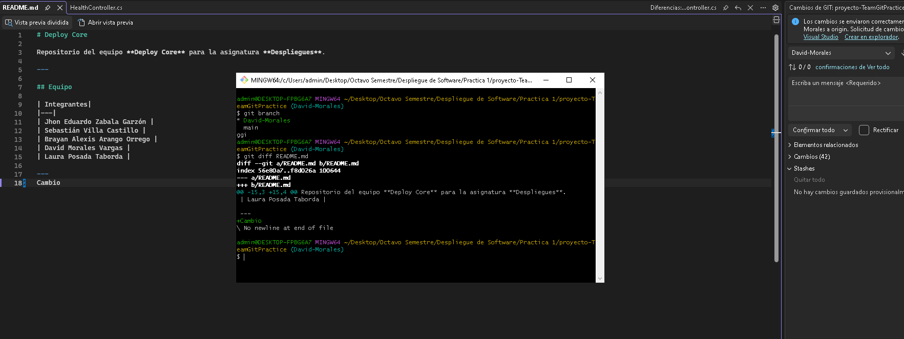
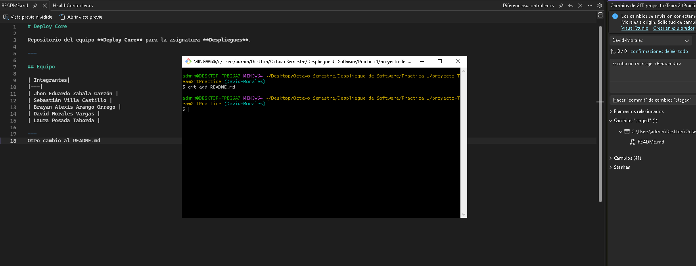
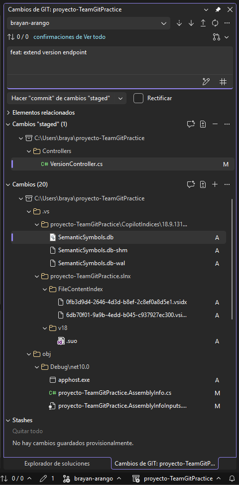
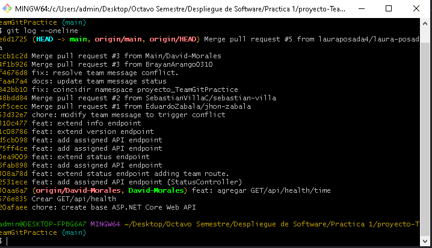
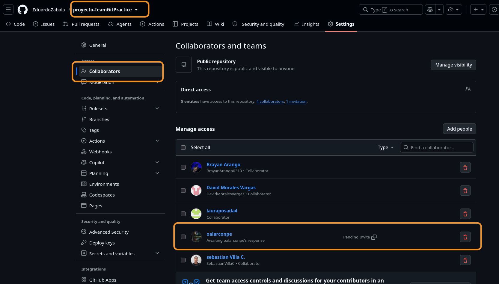

# EVIDENCIAS.md

## Tabla de integrantes

| Integrante | Nombre completo | Rama personal | Commit consola | Commit Visual Studio | Pull Request | Reviewer |
|---|---|---|---|---|---|---|
| 1 | Jhon Eduardo Zabala Garzón | jhon-zabala | 2531ece | 308a78d | https://github.com/EduardoZabala/proyecto-TeamGitPractice/pull/2 | Sebastian Villa |
| 2 | Sebastián Villa Castillo | sebastian-villa | 6fab898 | 0ea9009 | https://github.com/EduardoZabala/proyecto-TeamGitPractice/pull/4 | Brayan Arango |
| 3 | Brayan Alexis Arango Orrego | brayan-arango | 75ff4ce | 1c08786 | https://github.com/EduardoZabala/proyecto-TeamGitPractice/pull/6 | David Morales Vargas |
| 4 | David Morales Vargas | David-Morales | 576a835 | 30aa6a7 | https://github.com/EduardoZabala/proyecto-TeamGitPractice/pull/3 | Laura Posada |
| 5 | Laura Posada Taborda | laura-posada | d5cb098  | 310c477 | https://github.com/EduardoZabala/proyecto-TeamGitPractice/pull/5 | Jhon Zabala |

## Conflicto resuelto

- **Pull Request donde se resolvió el conflicto:** https://github.com/EduardoZabala/proyecto-TeamGitPractice/pull/6
- **Hash del commit que resolvió el conflicto:** `f4676d8` (fix: resolve team message conflict)
- **Evidencia restore:**

- **Evidencia restore --staged:**

- **Hash del commit temporal:** `f8d0723` (test: add temporary note)
- **Hash del commit generado por revert:** `fa53476` (Revert "test: add temporary note")
- **Captura git change:**

- **Captura git bash:**

- **Comprobación de que orlapez fue agregado como colaborador:**

